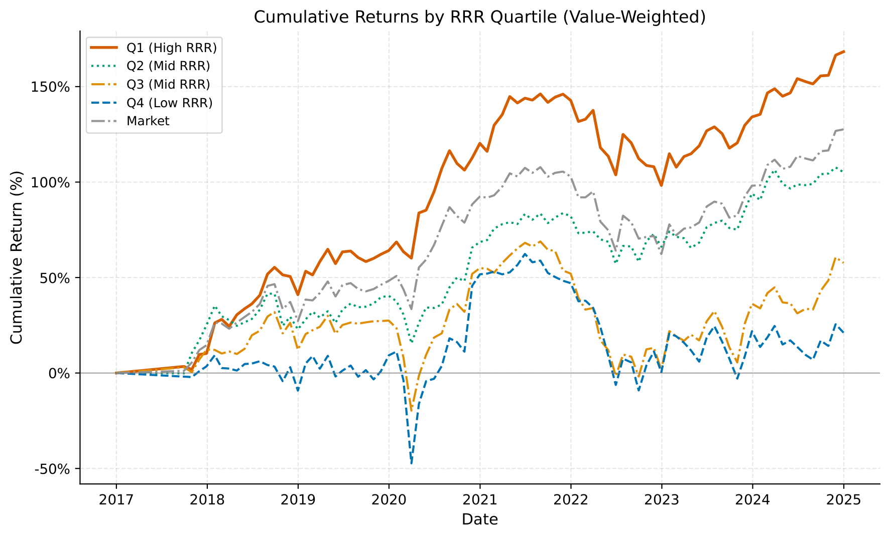

# Portfolio Construction With Loyalty Signal (Alternative Data)

Research code for a study asking whether a firm's **Revenue Retention Rate (RRR)**, the share of prior-quarter revenue recovered this quarter by returning customers, predicts future risk-adjusted stock returns. The idea: markets may misprice how a firm's revenue growth is *composed* (new customers vs. returning ones) the same way they misprice earnings composition.

**Data:** quarterly credit card transaction data for 124 U.S. firms, 2017-2024, used to construct RRR at the firm-quarter level.

**Method:** portfolios are sorted on RRR two months after quarter-end (to clear standard SEC filing deadlines) and long-short RRR returns are evaluated against the Fama-French three- and five-factor models, alongside Fama-MacBeth cross-sectional regressions.

## Result

Firms in the top RRR quartile (Q1) substantially outperform both the market and the bottom RRR quartile (Q4) in cumulative value-weighted returns, consistent with RRR carrying priced, forward-looking information about revenue quality that isn't visible in financial statements. The underlying data runs 2017-2024; the chart's return series extends into 2025 because portfolios formed on the last data quarters are still being return-tracked forward in time.

## Repository contents

- Portfolio construction, factor-model regressions, and Fama-MacBeth estimation (`analysis_v2.py`, `performance_metrics.py`, `identification_battery.py`)
- Robustness diagnostics (`robustness_diagnostics.py`, `exclude_amazon_robustness.py`, `downside_beta_reconciliation.py`, `future_beta_retry.py`)
- Table and figure generation (`generate_tables_figures.py`, `build_presentation_2026-07-06.py`)
- `output/` — small derived result artifacts (tables, robustness exports)

## Data

The underlying credit card transaction data and firm-level financial statement data are proprietary/licensed and are not included in this repository. Code is provided for transparency and methodology review.
